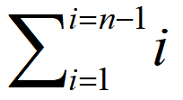

# JavaScript 部分

## 1. 数组部分

### 1.1 去重

```javascript

const arr=[1,2,'2',2,3,4,5];

// 1. ES6 Set
const set=[...new Set(arr)]
console.log(set);    // [ 1, 2,'2', 3, 4, 5 ]

// 2.for循环
function uniq(arr) {
  let _result = [];
  for (let i = 0; i < arr.length; i++) {
    if (!_result.includes(arr[i])) {   // includes 为 === 比较
      _result.push(arr[i]);
    }
  }
  return _result;
}
console.log(uniq(arr)); // [ 1, 2,'2', 3, 4, 5 ]

```

### 1.2 冒泡排序

```javascript
// 5个球进行排序，需要比较4轮，共比较次数 4+3+2+1=10次。
//比较此时公式：

```
